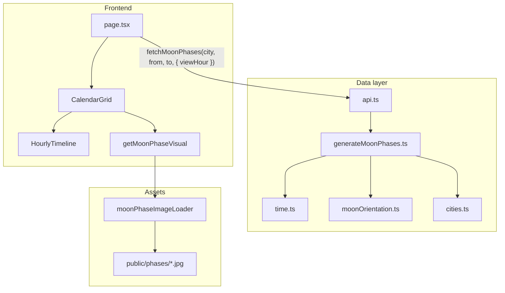

# Data flow

How a moon phase gets from user action to a pixel on screen.

## Diagram

## Step by step

1. **User picks city, theme, and viewing time** — City sets observer lat/lon and IANA timezone. Viewing-time slider (default 9pm) sets `viewHour` for daily themes.
2. **Date range in city TZ** — `time.ts` computes local `YYYYMMDD` bounds (e.g. current month + 5 months for Calendar).
3. **`fetchMoonPhases` runs** — For each local day at `viewHour` (or each 3h step from local midnight):
   - Convert local date + hour → UTC instant (`date_utc`)
   - `astronomy-engine`: illumination, phase angle, major phases
   - `moonOrientation.ts`: parallactic rotation at that UTC instant
   - Set `date_local` for grouping
4. **Results stored** — `MoonPhaseEntry[]` in React state; poster years cached by `{year}-{viewHour}`.
5. **`CalendarGrid` renders** — Groups cells by `date_local`, not UTC date.
6. **Each cell** — `getMoonPhaseVisual(entry)` → frame from `moon_age_days` + `rotate(entry.rotation_angle)`.

## Viewing-time slider

Changing `viewHour` debounces (~150ms) and regenerates the current date range. Hidden for Hourly Timeline (theme is already time-resolved).

## Infinite scroll

Uses city-local month arithmetic via `time.ts` when appending or prepending 6-month chunks.

## Resolution

| Theme | Sampling |
|-------|----------|
| Calendar, Lunar Cycle, Poster | Daily at `viewHour` local |
| Hourly Timeline | 3h from local midnight + exact major phases |

## Related

- [Data model](./data-model.md)
- [Backend](./backend.md) — optional, not used by UI
